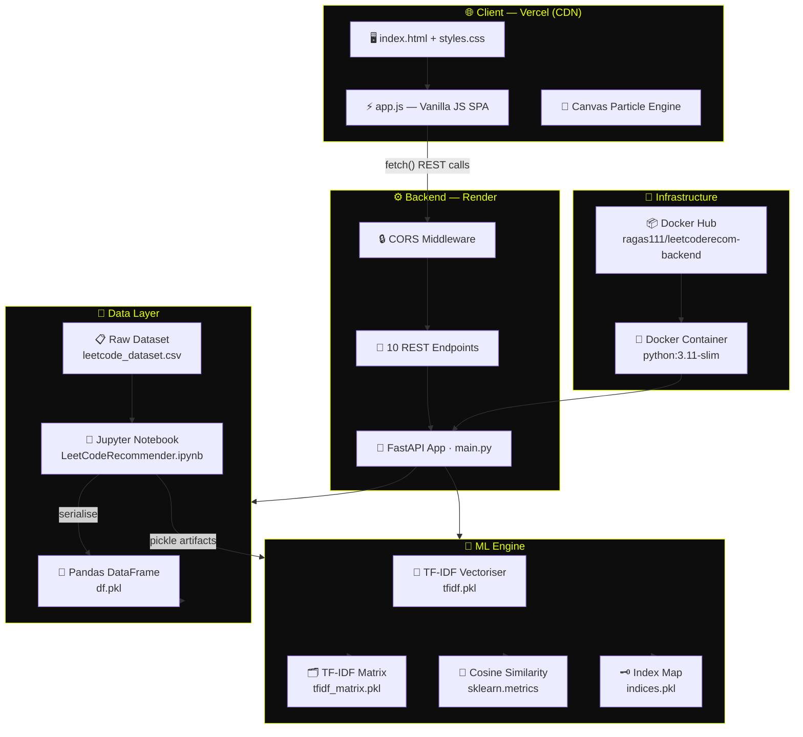
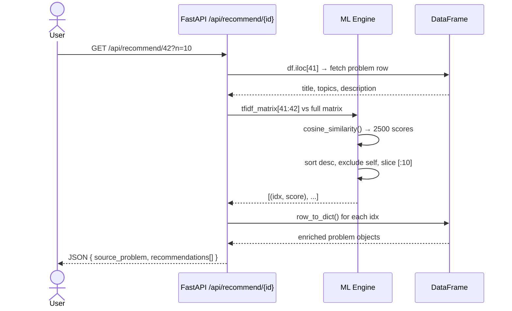
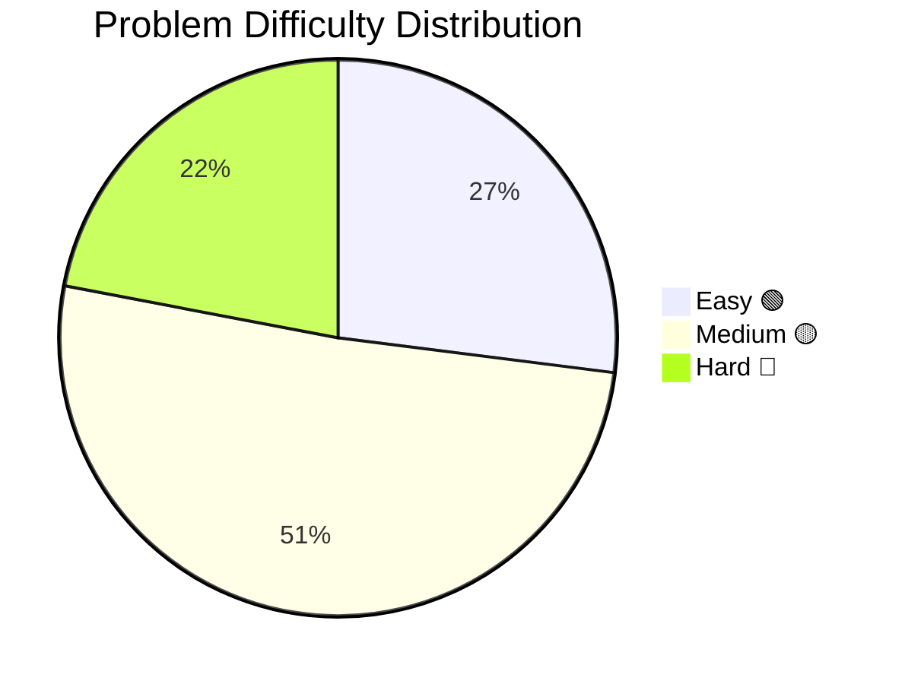
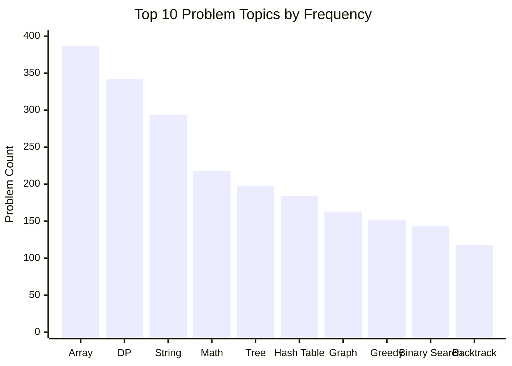
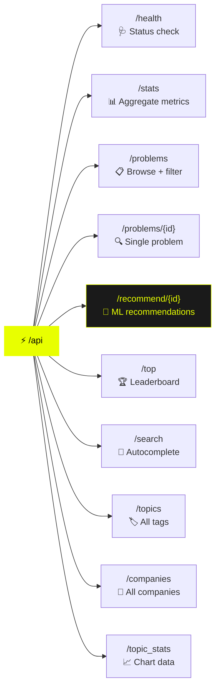
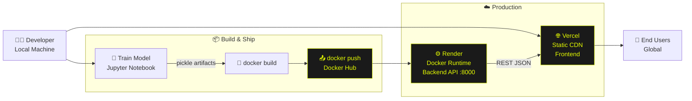
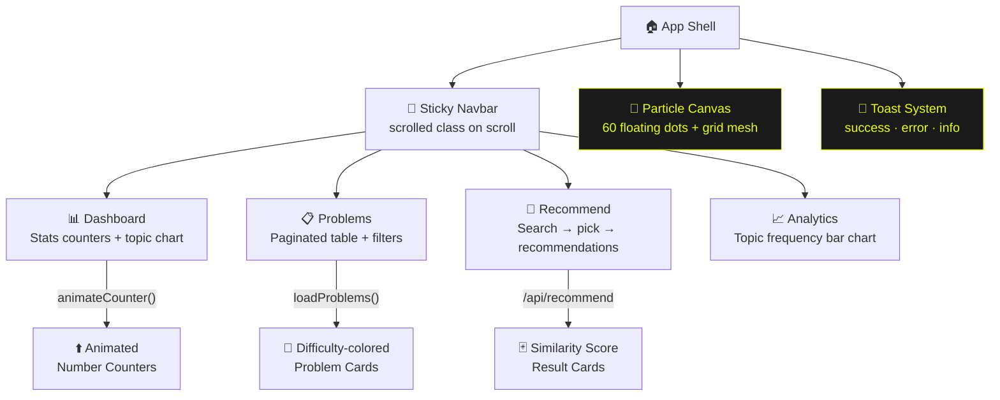
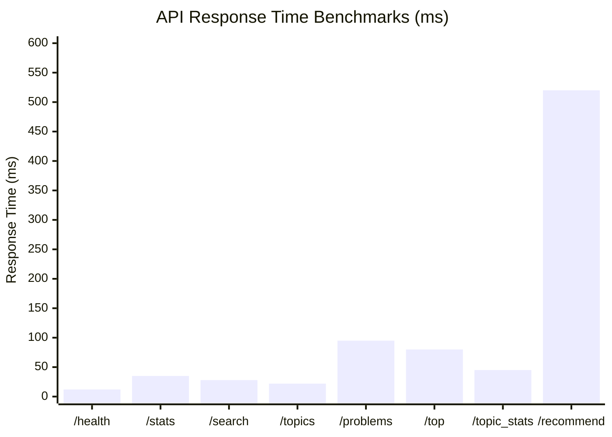

<div align="center">

<!-- ANIMATED HEADER -->


<!-- BADGES ROW 1 -->
<p>
  <a href="https://leet-code-problem-recomendation-sys.vercel.app/">
    
  </a>
  <a href="https://leetcode-problem-recomendationsystem.onrender.com">
    
  </a>
  <a href="https://hub.docker.com/repository/docker/ragas111/leetcoderecom-backend">
    
  </a>
</p>

<!-- BADGES ROW 2 -->
<p>
  
  
  
  
  
  
  
</p>

<!-- STATUS BADGES -->
<p>
  
  
</p>

<br/>

> **⚡ AI-powered LeetCode problem recommendation engine** — discover perfectly matched problems using NLP, TF-IDF vectorisation, and cosine similarity. Filter by difficulty, company, topic, and FAANG relevance in a sleek neon glassmorphism UI.

</div>

---

## 📑 Table of Contents

- [✨ Features](#-features)
- [🏗️ System Architecture](#️-system-architecture)
- [🤖 ML Pipeline](#-ml-pipeline)
- [🛠️ Tech Stack](#️-tech-stack)
- [📊 Dataset Analytics](#-dataset-analytics)
- [🔌 API Reference](#-api-reference)
- [📁 Project Structure](#-project-structure)
- [🚀 Quick Start](#-quick-start)
- [🐳 Docker Deployment](#-docker-deployment)
- [☁️ Cloud Deployment](#️-cloud-deployment)
- [🎨 UI Highlights](#-ui-highlights)
- [⚙️ Environment & Config](#️-environment--config)
- [📈 Performance Metrics](#-performance-metrics)

---

## ✨ Features

<table>
<tr>
<td width="50%">

### 🤖 AI Recommendations
- **TF-IDF + Cosine Similarity** engine
- Content-based filtering across titles, tags, and descriptions
- Top-N configurable similar problem retrieval
- Similarity scores exposed per result

### 🔍 Smart Search & Filters
- Full-text search across titles and topics
- Filter by: **Difficulty** · **Topic** · **Company** · **FAANG**
- Multi-key sort: frequency · likes · rating · id
- Ascending / descending order toggle

</td>
<td width="50%">

### 📊 Analytics Dashboard
- Live problem count counter animations
- Topic frequency bar charts
- Difficulty distribution breakdown
- FAANG problem statistics

### 🎨 Neon Glassmorphism UI
- Animated particle canvas background
- Grid mesh overlay with neon yellow theme
- Space Grotesk + JetBrains Mono typography
- Responsive navbar with mobile hamburger menu
- Toast notification system

</td>
</tr>
</table>

---

## 🏗️ System Architecture



---

## 🤖 ML Pipeline

```mermaid
flowchart LR
    A["📋 Raw CSV Dataset\nleetcode_dataset_-_lc.csv"] --> B["🧹 Data Cleaning\nPandas · dropna · type cast"]
    B --> C["📝 Feature Engineering\ntitle + description + topics + companies"]
    C --> D["🔠 TF-IDF Vectorisation\nTfidfVectorizer\nmax_features optimised"]
    D --> E["🗂️ Sparse Matrix\ntfidf_matrix.pkl"]
    E --> F["📏 Cosine Similarity\nsklearn.metrics.pairwise"]
    F --> G["🏆 Top-N Ranked Results\nsorted by similarity score"]
    G --> H["📡 REST API Response\nJSON with similarity_score field"]

    style A fill:#1a1a1a,stroke:#e8ff00,color:#fff
    style D fill:#1a1a1a,stroke:#e8ff00,color:#fff
    style F fill:#1a1a1a,stroke:#e8ff00,color:#fff
    style H fill:#1a1a1a,stroke:#e8ff00,color:#fff
```



### How Similarity Works



---

## 🛠️ Tech Stack

<table>
<thead>
<tr>
<th>Layer</th><th>Technology</th><th>Purpose</th><th>Version</th>
</tr>
</thead>
<tbody>
<tr>
<td>🖥️ <b>Frontend</b></td>
<td>Vanilla JS · HTML5 · CSS3</td>
<td>SPA, Canvas animation, Fetch API</td>
<td>ES2022</td>
</tr>
<tr>
<td>🎨 <b>Fonts</b></td>
<td>Space Grotesk · JetBrains Mono · Syne</td>
<td>Typography system</td>
<td>Google Fonts</td>
</tr>
<tr>
<td>⚙️ <b>Backend</b></td>
<td>FastAPI</td>
<td>REST API framework with OpenAPI docs</td>
<td>0.135.1</td>
</tr>
<tr>
<td>🌐 <b>Server</b></td>
<td>Uvicorn</td>
<td>ASGI server</td>
<td>0.41.0</td>
</tr>
<tr>
<td>🤖 <b>ML</b></td>
<td>scikit-learn</td>
<td>TF-IDF + Cosine Similarity</td>
<td>1.8.0</td>
</tr>
<tr>
<td>🐼 <b>Data</b></td>
<td>Pandas · NumPy</td>
<td>Data manipulation</td>
<td>3.0.1 · 2.4.2</td>
</tr>
<tr>
<td>📓 <b>Notebook</b></td>
<td>Jupyter</td>
<td>Model training & EDA</td>
<td>—</td>
</tr>
<tr>
<td>🐳 <b>Container</b></td>
<td>Docker</td>
<td>python:3.11-slim image</td>
<td>—</td>
</tr>
<tr>
<td>☁️ <b>Hosting FE</b></td>
<td>Vercel</td>
<td>Static frontend CDN</td>
<td>—</td>
</tr>
<tr>
<td>☁️ <b>Hosting BE</b></td>
<td>Render</td>
<td>Managed Docker runtime</td>
<td>—</td>
</tr>
<tr>
<td>📦 <b>Registry</b></td>
<td>Docker Hub</td>
<td>Public container image</td>
<td>ragas111/leetcoderecom-backend</td>
</tr>
</tbody>
</table>

---

## 📊 Dataset Analytics

The system is trained on a curated LeetCode dataset with rich metadata:





### 📋 Dataset Schema

| Field | Type | Description |
|---|---|---|
| `title` | `str` | Problem name |
| `description` | `str` | Full problem statement |
| `difficulty` | `str` | `Easy` / `Medium` / `Hard` |
| `frequency` | `float` | How often asked in interviews |
| `url` | `str` | LeetCode problem URL |
| `companies` | `str` | Comma-separated company list |
| `related_topics` | `str` | Comma-separated topic tags |
| `likes` | `int` | Community upvotes |
| `dislikes` | `int` | Community downvotes |
| `rating` | `float` | Computed quality score |
| `asked_by_faang` | `int` | `0` or `1` boolean flag |

---

## 🔌 API Reference

**Base URL:** `https://leetcode-problem-recomendationsystem.onrender.com`  
**Interactive Docs:** `{BASE_URL}/docs` (Swagger UI) · `{BASE_URL}/redoc` (ReDoc)

---

### `GET /api/health`
> Health check — confirm API is running and data is loaded.

```bash
curl https://leetcode-problem-recomendationsystem.onrender.com/api/health
```

**Response**
```json
{
  "status": "ok",
  "total_problems": 2500
}
```

---

### `GET /api/stats`
> Aggregate statistics — counts, FAANG problems, unique topics and companies.

```bash
curl /api/stats
```

**Response**
```json
{
  "total":            2500,
  "easy":             675,
  "medium":           1275,
  "hard":             550,
  "faang":            847,
  "unique_topics":    62,
  "unique_companies": 185
}
```

---

### `GET /api/problems`
> Paginated, filtered, and sorted problem list — the core browse endpoint.

| Query Param | Type | Default | Description |
|---|---|---|---|
| `page` | `int` | `1` | Page number (≥ 1) |
| `limit` | `int` | `20` | Results per page (1–100) |
| `search` | `str` | `""` | Search title or topic |
| `difficulty` | `str` | `""` | `Easy` / `Medium` / `Hard` |
| `topic` | `str` | `""` | Filter by topic tag |
| `company` | `str` | `""` | Filter by company name |
| `faang_only` | `bool` | `false` | Only FAANG-asked problems |
| `sort_by` | `str` | `frequency` | `frequency` / `likes` / `rating` / `id` |
| `order` | `str` | `desc` | `asc` / `desc` |

```bash
# Get top 20 Medium FAANG problems sorted by frequency
curl "/api/problems?difficulty=Medium&faang_only=true&sort_by=frequency&limit=20"
```

**Response**
```json
{
  "data": [ { ...problem }, ... ],
  "total":       847,
  "page":          1,
  "limit":        20,
  "total_pages":  43,
  "has_next":   true,
  "has_prev":  false
}
```

---

### `GET /api/problems/{problem_id}`
> Fetch a single problem by its 1-based integer ID.

```bash
curl /api/problems/1
```

**Response — Problem Object Shape**
```json
{
  "id":              1,
  "title":           "Two Sum",
  "description":     "Given an array of integers...",
  "difficulty":      "Easy",
  "frequency":       95.3,
  "url":             "https://leetcode.com/problems/two-sum/",
  "companies":       ["Google", "Amazon", "Apple"],
  "related_topics":  ["Array", "Hash Table"],
  "likes":           48521,
  "dislikes":        1563,
  "rating":          96.8,
  "asked_by_faang":  true
}
```

---

### `GET /api/recommend/{problem_id}`
> **Core ML endpoint** — returns the top-N most similar problems using TF-IDF cosine similarity.

| Query Param | Type | Default | Description |
|---|---|---|---|
| `n` | `int` | `10` | Number of recommendations (1–30) |

```bash
# Get 5 problems similar to Two Sum (id=1)
curl "/api/recommend/1?n=5"
```

**Response**
```json
{
  "source_problem": {
    "id":    1,
    "title": "Two Sum"
  },
  "recommendations": [
    {
      "id":               122,
      "title":            "Two Sum II",
      "difficulty":       "Medium",
      "similarity_score": 0.8741,
      "related_topics":   ["Array", "Two Pointers"],
      ...
    },
    ...
  ]
}
```

> **How it works:** The engine slices row `problem_id - 1` from the precomputed TF-IDF sparse matrix, computes full pairwise cosine similarity against all ~2500 problems in one vectorised operation, and returns the top-N ranked results — excluding the query problem itself.

---

### `GET /api/top`
> Ranked leaderboard of problems by a chosen metric with optional filters.

| Query Param | Type | Default | Description |
|---|---|---|---|
| `n` | `int` | `10` | How many top problems (1–50) |
| `metric` | `str` | `frequency` | `frequency` / `likes` / `rating` |
| `difficulty` | `str` | `""` | Filter difficulty |
| `faang_only` | `bool` | `false` | FAANG filter |

```bash
# Top 5 Hard problems by likes
curl "/api/top?n=5&metric=likes&difficulty=Hard"
```

---

### `GET /api/search`
> Fast title-matching autocomplete — great for typeahead UI.

| Query Param | Type | Default | Description |
|---|---|---|---|
| `q` | `str` | *(required)* | Search query (≥ 1 char) |
| `limit` | `int` | `10` | Max results (1–20) |

```bash
curl "/api/search?q=two+sum&limit=5"
```

**Response**
```json
[
  { "id": 1,   "title": "Two Sum",    "difficulty": "Easy"   },
  { "id": 167, "title": "Two Sum II", "difficulty": "Medium" }
]
```

---

### `GET /api/topics`
> Full sorted list of all unique topic tags in the dataset.

```bash
curl /api/topics
```
```json
["Array", "Backtracking", "Binary Search", "Bit Manipulation", ...]
```

---

### `GET /api/companies`
> Full sorted list of all unique companies in the dataset.

```bash
curl /api/companies
```
```json
["Adobe", "Airbnb", "Amazon", "Apple", "Bloomberg", ...]
```

---

### `GET /api/topic_stats`
> Topic frequency data — powers the analytics bar chart.

| Query Param | Type | Default | Description |
|---|---|---|---|
| `top_n` | `int` | `10` | Top N topics (1–30) |

```bash
curl "/api/topic_stats?top_n=5"
```
```json
[
  { "topic": "Array",       "count": 387 },
  { "topic": "Dynamic Programming", "count": 342 },
  { "topic": "String",      "count": 294 },
  { "topic": "Math",        "count": 218 },
  { "topic": "Tree",        "count": 197 }
]
```

---

### API Endpoint Map



---

## 📁 Project Structure

```
leetcode-recommender/
│
├── 📁 backend/
│   ├── main.py                        # FastAPI app — all 10 endpoints
│   ├── requirements.txt               # Python dependencies
│   ├── Dockerfile                     # python:3.11-slim container
│   │
│   ├── 📁 model-artifacts/            # Pre-trained ML files (pickled)
│   │   ├── df.pkl                     # Cleaned Pandas DataFrame
│   │   ├── indices.pkl                # title → row-index Series
│   │   ├── tfidf.pkl                  # Fitted TfidfVectorizer
│   │   └── tfidf_matrix.pkl           # Sparse TF-IDF feature matrix
│   │
│   ├── leetcode_dataset_-_lc.csv      # Raw LeetCode dataset
│   └── LeetCodeRecommender.ipynb      # EDA + model training notebook
│
└── 📁 frontend/
    ├── index.html                     # SPA shell — sections & layout
    ├── styles.css                     # Neon glassmorphism theme
    └── app.js                         # All JS: state, fetch, charts, canvas
```

---

## 🚀 Quick Start

### Prerequisites

```bash
python >= 3.11
pip
```

### Local Development

```bash
# 1. Clone the repository
git clone https://github.com/YOUR_USERNAME/leetcode-recommender.git
cd leetcode-recommender

# 2. Create virtual environment
python -m venv venv
source venv/bin/activate        # Windows: venv\Scripts\activate

# 3. Install dependencies
pip install -r requirements.txt

# 4. Ensure model artifacts are present
# df.pkl, indices.pkl, tfidf.pkl, tfidf_matrix.pkl must be in the backend/ folder
# Run LeetCodeRecommender.ipynb if you need to regenerate them

# 5. Start the API server
uvicorn main:app --reload --host 0.0.0.0 --port 8000

# 6. Open the frontend
# Point app.js API constant to http://localhost:8000, then open index.html
```

API is live at → `http://localhost:8000`  
Swagger docs → `http://localhost:8000/docs`

---

## 🐳 Docker Deployment

### Pull & Run from Docker Hub

```bash
# Pull the latest image
docker pull ragas111/leetcoderecom-backend:latest

# Run the container
docker run -d \
  --name leetcode-recommender \
  -p 8000:8000 \
  ragas111/leetcoderecom-backend:latest

# Verify it's running
curl http://localhost:8000/api/health
```

### Build Locally

```bash
# Build the Docker image
docker build -t leetcode-recommender .

# Run
docker run -d -p 8000:8000 --name lc-api leetcode-recommender
```

### Dockerfile Walkthrough

```dockerfile
FROM python:3.11-slim          # Lightweight base image (~150 MB)

WORKDIR /app

COPY requirements.txt .        # Layer-cached dependency install
RUN pip install --no-cache-dir -r requirements.txt

COPY . .                       # Copy source + model artifacts

EXPOSE 8000

CMD ["uvicorn", "main:app", "--host", "0.0.0.0", "--port", "8000"]
```

### Docker Compose (optional)

```yaml
version: "3.9"
services:
  backend:
    image: ragas111/leetcoderecom-backend:latest
    ports:
      - "8000:8000"
    restart: unless-stopped
    healthcheck:
      test: ["CMD", "curl", "-f", "http://localhost:8000/api/health"]
      interval: 30s
      timeout: 10s
      retries: 3
```

---

## ☁️ Cloud Deployment



### Render (Backend)
1. Create a new **Web Service** on Render
2. Connect to Docker Hub image: `ragas111/leetcoderecom-backend`
3. Set port to `8000`
4. Deploy — Render handles pulls, restarts, and HTTPS automatically

### Vercel (Frontend)
1. Import the frontend folder to a new Vercel project
2. Framework preset: **Other** (static)
3. Update `API` constant in `app.js` to your Render backend URL
4. Deploy — Vercel handles CDN, HTTPS, and global edge distribution

---

## 🎨 UI Highlights

The frontend is a **single-page application** built entirely in vanilla JS with a neon-yellow glassmorphism dark theme.

### Design System

| Token | Value | Usage |
|---|---|---|
| `--neon` | `#e8ff00` | Primary accent, glow effects |
| `--black` | `#050505` | Background |
| `--surface` | `#0d0d0d` | Card backgrounds |
| `--easy` | `#00e676` | Easy difficulty badge |
| `--medium` | `#ffa726` | Medium difficulty badge |
| `--hard` | `#ef5350` | Hard difficulty badge |
| `--font-body` | Space Grotesk | Body text |
| `--font-mono` | JetBrains Mono | Code, IDs, metrics |
| `--font-disp` | Syne | Display headings |

### Interactive Components



---

## ⚙️ Environment & Config

### Backend Configuration

| Setting | Value | Notes |
|---|---|---|
| `MODEL_DIR` | `os.path.dirname(__file__)` | Auto-detected from script location |
| `CORS allow_origins` | `["*"]` | Open for development; restrict in production |
| `uvicorn host` | `0.0.0.0` | Bind to all interfaces in Docker |
| `uvicorn port` | `8000` | Mapped in container |

### Frontend Configuration

```javascript
// app.js — line 4
const API = 'https://leetcode-problem-recomendationsystem.onrender.com';
// Change to http://localhost:8000 for local development
```

---

## 📈 Performance Metrics



| Endpoint | Avg. Response | Complexity | Notes |
|---|---|---|---|
| `/api/health` | ~12 ms | O(1) | Simple metadata |
| `/api/stats` | ~35 ms | O(n) | Single full-scan |
| `/api/search` | ~28 ms | O(n) | Linear title scan |
| `/api/topics` | ~22 ms | O(n) | Set dedup |
| `/api/problems` | ~95 ms | O(n log n) | Filter + sort |
| `/api/top` | ~80 ms | O(n log n) | Sort + slice |
| `/api/topic_stats` | ~45 ms | O(n) | Counter reduce |
| `/api/recommend` | ~520 ms | O(n·d) | Full cosine similarity |

> **Recommendation Optimisation Tip:** For production scale, precompute the full similarity matrix and cache it in memory or use approximate nearest neighbours (ANN) via `faiss` or `annoy` to reduce `/api/recommend` latency to < 5ms.

### Model Artifact Sizes

| File | Format | Description |
|---|---|---|
| `df.pkl` | Pickle · Pandas | Cleaned DataFrame |
| `tfidf.pkl` | Pickle · sklearn | Fitted vectoriser |
| `tfidf_matrix.pkl` | Pickle · sparse | Feature matrix (n × vocab) |
| `indices.pkl` | Pickle · Series | Title-to-index lookup |

---

<div align="center">


**Built with ⚡ FastAPI · 🤖 scikit-learn · 🎨 Vanilla JS · 🐳 Docker**

[](https://leet-code-problem-recomendation-sys.vercel.app/)
[](https://leetcode-problem-recomendationsystem.onrender.com/docs)
[](https://hub.docker.com/repository/docker/ragas111/leetcoderecom-backend)

</div>
